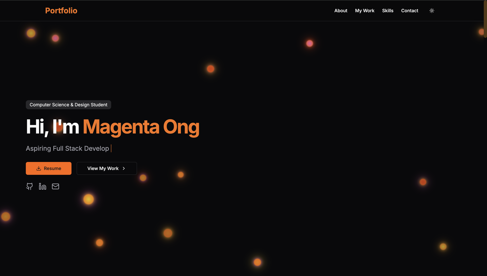

# My Portfolio

This is a **personal portfolio website** built with **Next.js, Tailwind CSS, and deployed on Vercel**. It showcases **projects, skills, freelance work**. The portfolio is designed with a **dark, modern and minimalistic aesthetic** (light mode is available too!), featuring smooth animations and an intuitive user experience.

## ✨ Live Demo

🔗 **[Visit Portfolio](https://magentaong.vercel.app/)**

## 📸 Preview



---

## 🛠️ Tech Stack

| Technology      | Purpose                                             |
|----------------|-----------------------------------------------------|
| **Next.js**    | React framework for fast and scalable web apps      |
| **Tailwind CSS** | Utility-first styling for rapid and responsive UI |
| **TypeScript** | Static typing for maintainability and robustness    |
| **Framer Motion** | Smooth animations and UI transitions           |
| **Lucide Icons** | Icon set for a modern, consistent look           |
| **Vercel**     | Deployment platform for optimized performance      |

---

## 🚀 Getting Started

To set up and run this portfolio locally:

### 1️⃣ Clone the Repository

```bash
git clone https://github.com/magentaong/Portfolio.git
cd Portfolio
```

### 2️⃣ Install Dependencies

```bash
npm install
# or
yarn install
```

### 3️⃣ Run the Development Server

```bash
npm run dev
# or
yarn dev
```

🔗 Open [http://localhost:3000](http://localhost:3000) in your browser.

---

## 🌍 Deployment

The portfolio is deployed using **Vercel**. To deploy your own version:

1. Push the project to GitHub.
2. Sign in to **[Vercel](https://vercel.com/)**
3. Import the repository and deploy.

💡 **Every commit to the main branch will trigger automatic deployments!**

---

## 📖 Lessons Learned

Throughout the development of this portfolio, I learned:

I learned **UI/UX principles**, designing a fully functional webpage for the first time, keeping **responsiveness** in mind while maintaining simple navigation. I also learned:
- **Page routing** in Next.js
- **Using components effectively** (e.g., project cards)
- **SEO optimization** for better Google search visibility
- **Creating smooth animations** with Framer Motion

---

## 🎨 Features

✅ **Dynamic Projects Showcase** – Explore different projects  
✅ **Freelance Work** – Custom portfolio pages for freelance projects  
✅ **Smooth Animations** – Framer Motion-powered UI interactions  
✅ **Dark Mode UI** – Aesthetic and accessibility considerations  
✅ **Optimized Performance** – Fast loading with Next.js and Vercel  

---

## 📌 Future Enhancements

📌 **Add Horizontal Scrolling** for project cards to show more media 
📌 **Add a Testimonials Section** for feedback from freelance clients as well as past testimonials
📌 **Integrate a Blog** for sharing insights and technical tutorials  
📌 **Adjust Responsiveness** for mobile phones
📌 **Include filtering** for projects to showcase multidisciplinary projects

---

## 👩‍💻 Contributing

If you'd like to contribute or suggest improvements:

1. Fork the repo  
2. Create a new branch: `git checkout -b feature-name`  
3. Commit changes: `git commit -m "Add feature"`  
4. Push to branch: `git push origin feature-name`  
5. Open a **Pull Request** 🎉  

---

## 📧 Contact

💡 Have feedback or need a personal portfolio? Reach out!  

📩 **Email:** [your-email@example.com](mailto:ongmagenta@gmail.com)  
🌐 **Website:** [https://magentaong.vercel.app/](https://magentaong.vercel.app/)  
🐙 **GitHub:** [@magentaong](https://github.com/magentaong)  

---

Built by Magenta Ong
